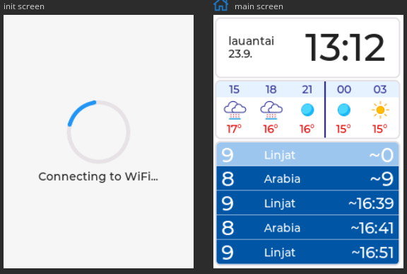
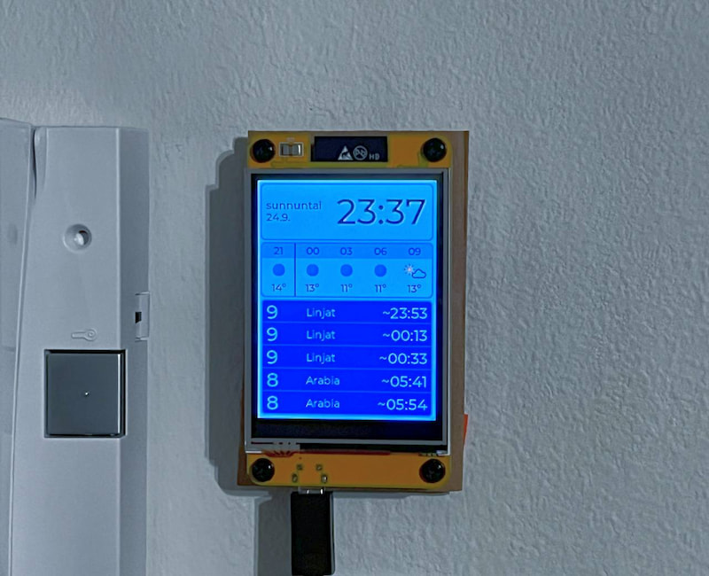

# esp32-clock-weather-bus-schedule-screen

Firmware for a ESP32-2432S032 2.8" TFT (resistive) touchscreen module to provide the following features:
- Clock
  * Synchronized via NTP
- Weather for the next 15 hours
  * Temperature and weather symbol, courtesy of the Finnish Meteorological Institute
- Public transport schedule for a couple of near bus/tram stops
  * Similar in style to the schedules you see on bus stops nowadays (https://omatnaytot.hsl.fi/createview).

The UI is implemented with LVGL. Their SquareLine Studio software was used to design the UIs, and export the bare UI elements into code. Based on the [esp32-smartdisplay library](https://github.com/rzeldent/esp32-smartdisplay)'s LVGL configs.

## Images

|  **UI design** |
| --- |
|    |
| |
| **Mounted on the wall** |
|  |

## Developing

1. Copy `include/secrets.h.example` to `include/secrets.h` and fill in the secrets
2. Uncomment the "Uncomment these if you want to flash over USB" portion of `platformio.ini` and comment out the OTA portion
3. Flash to your device

Now that the OTA functionality is flashed, use OTA for following updates if you want to:
4. Copy `upload_config.json.example` to `upload_config.json`
5. Do reverse of step 2 above where you comment out the OTA upload config

## Case

https://www.printables.com/model/577921-p1touch-sunton-esp32-2432s028r-case-alien3d-deck-r

## Licenses

### Code

MIT License. See LICENSE.

### Data

- FMI's open weather data is licensed under CC-BY-4.0. Ilmatieteen laitoksen avoin data. https://en.ilmatieteenlaitos.fi/open-data-licence.
- Public transport data comes from Digitransit's APIs. © Digitransit 2023 licensed under [CC-BY-4.0](https://creativecommons.org/licenses/by/4.0/).

